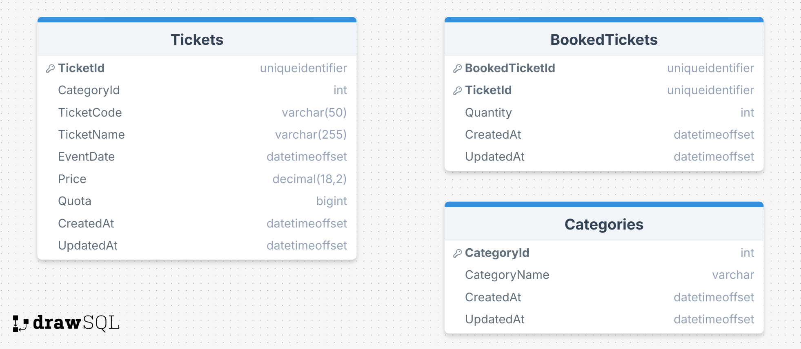

# Acceloka Web API

Acceloka Web API adalah sebuah sistem pemesanan tiket online (bioskop, kereta, kapal, pesawat, hotel) menggunakan **ASP.NET Core Web API**. Proyek ini meliputi fitur:
- **GET** tiket tersedia (filter, sorting, pagination)
- **POST** booking tiket
- **GET** detail booking (by BookedTicketId)
- **PUT** edit booking (ubah quantity)
- **DELETE** revoke sebagian/seluruh tiket

## Teknologi

- **.NET 8** (ASP.NET Core Web API)
- **Entity Framework Core** untuk akses database (SQL Server)
- **Serilog** untuk logging (menulis log ke folder `logs`)
- **Swagger** untuk dokumentasi dan test endpoint

## Fitur-Fitur Utama

1. **Get Available Tickets**  
   - Endpoint: `GET /api/v1/get-available-ticket`
   - Menerima query param untuk filter (categoryName, ticketCode, price, date range, dsb.)

2. **Book Ticket**  
   - Endpoint: `POST /api/v1/book-ticket`
   - Body JSON: daftar ticketCode & quantity
   - Validasi kuota dan pengurangan quota

3. **Get Booked Ticket**  
   - Endpoint: `GET /api/v1/get-booked-ticket/{bookedTicketId}`
   - Menampilkan detail booking (category, ticketCode, quantity, dsb.)

4. **Edit Booked Ticket**  
   - Endpoint: `PUT /api/v1/edit-booked-ticket/{bookedTicketId}`
   - Body JSON: daftar ticketCode & quantity baru
   - Menyesuaikan quota (menambah atau mengurangi)

5. **Revoke Ticket**  
   - Endpoint: `DELETE /api/v1/revoke-ticket/{bookedTicketId}/{ticketCode}/{qty}`
   - Mengembalikan sebagian tiket (qty), menambah quota, jika qty=0 hapus row

## Strukur Folder

- `Acceloka/` : Proyek Web API utama (Controllers, Models, Services)
- `Acceloka.Entities/` : Project class library untuk entitas database (DbContext, model EF)
- `Database/` : Berisi file `.bak` (backup DB) & (opsional) file .png ERD
- `logs/` : Menyimpan file log harian dari Serilog
- `.github/workflows/` : Pipeline GitHub Actions (opsional)
- `.gitignore` : Daftar file/folder yang tidak di-commit
- `MiniProjectBackend.sln` : File solution Visual Studio

## Cara Menjalankan

1. **Clone** repository:
   ```bash
   git clone https://github.com/username/Acceloka-WebAPI.git
   cd Acceloka-WebAPI

2. Setup Connection String
- Gunakan User Secrets atau environment variable untuk ConnectionStrings:AccelokaDB.
- Contoh user secrets:
dotnet user-secrets init
dotnet user-secrets set "ConnectionStrings:AccelokaDB" "Server=localhost;Database=Acceloka;User Id=sa;Password=xxx;Encrypt=False"

3. Restore & Build
dotnet restore
dotnet build

4. Run
dotnet run
Atau dari Visual Studio: F5 / Start Debug.

5. Akses Swagger
- Buka https://localhost:<port>/swagger untuk dokumentasi endpoint.

Visualisasi Database


Lisensi
Proyek ini berlisensi MIT (opsional, tergantung kebijakanmu).